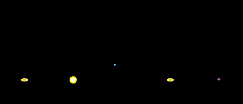

# Wanimation Studio Documentation

## Table of Contents

-   [WAN Files](#wan-files)
-   [Sprite Format](#sprite-format)
    -   [What is a Cel?](#what-is-a-cel)
    -   [Palette Info](#palette-info)
    -   [Creation Modes](#creation-modes)
    -   [Export Format](#export-format)
-   [Sprite Generator](#sprite-generator)
    -   [Folder Requirements](#folder-requirements)
    -   [Using the Sprite Generator](#using-the-sprite-generator)
    -   [Sprite Generator Configurations](#sprite-generator-configurations)
    -   [How to Use with `SetAnimation()`](#how-to-use-with-setanimation)
-   [Frames Generator](#frames-generator)
    -   [Folder Requirements](#folder-requirements)
    -   [Using the Frames Generator](#using-the-frames-generator)
    -   [Frames Generator Configurations](#frames-generator-configurations)
-   [Bulk Conversion](#bulk-conversion)

# WAN Files

**WAN** is a binary sprite format used by **Pokémon Mystery Dungeon: Explorers of Sky** to store animated sprites. Most animated sprites, from objects to Pokémon sprites, are stored as WAN files.

WAN files come in three different sprite types:

- **Type 0**: Used for **objects** and **common animations**.
- **Type 1**: Used for **Pokémon sprites**. These are stored in the `MONSTER/monster.bin`, `MONSTER/m_ground.bin`, and `MONSTER/m_attack.bin` pack files.
- **Type 2**: Used for **effects**, including move animations and script effects. These are stored in the `EFFECT/effect.bin` pack file.

# Sprite Format

Before diving into the generators, it helps to understand some basics about **cels** and the sprite formats used by **Type 0** and **Type 2** WAN files.

## What is a Cel?

<div align="center">
    
</div>

A **cel** (short for _celluloid_) represents a single image used in a specific frame and layer.

As you can see in the image above, each frame in this sprite is made up of **three cels** stacked on top of each other to form the final frame.

## Palette

The game uses palette slots to store colors. There are 16 slots, each holding **16 colors**, for a total of **256 colors**. But the first color in each slot is always transparent, so you actually get **240** usable colors.

<div align="center">
    
</div>

The game shares these slots among various elements. and some slots are occupied by base animation colors.

### Ground Mode

In ground mode, these slots is shared between base ground effects and objects.

**Base Ground Effects**

<div align="center">
    
</div>

-   The game reserves **4 palette slots** for base ground effects, giving you **64 colors** but since 4 are reserved for transparency, there are **60 unique usable colors**.

**Objects**

<div align="center">
    
</div>

-   The game reserves **12 palette slots** for objects, This gives a total of **192 colors**, but since 12 are reserved for transparency, there are **180 unique usable colors**.

-   These **12 slots** are shared across all objects on screen — so the total combined palette groups of all visible objects **can't exceed 12**.

-   Objects can also use colors from 4 palette slots reserved for base ground effects so thretically each object can have maximum of **240 visible colors**.

### Dungeon Mode

In dungeon mode, these slots is shared between base dungeon effects and standalone effects.

**Base Dungeon Effects**

<div align="center">
    
</div>

-   The game reserves **13 palette slots** for base dungeon effects, giving you **208 colors** but since 13 are reserved for transparency, there are **195 unique usable colors**.

**Standalone Effects**

<div align="center">
    
</div>

-   The game reserves **3 palette slots** for standalone effects, giving you **48 colors** but since 3 are reserved for transparency, there are **45 unique usable colors**.

-   Standalone effects can also use colors from 13 palette slots reserved for base dungeon effects so thretically each standalone effect can have maximum of **240 visible colors**.

## Image Creation

The palette of the image depend on whether you wanna use base animation palette slot or not. like if you wanna use base animation palette then you need to make your image with 256 colors

if you dont wanna use base animation palette then you need to make your image according to type of wan file you are creating like 12 slots for objects or 3 slots for move effects

The **Sprite Generator** accepts frame images in **two modes**:

-   **Single-Cel Frame Mode**
-   **Multi-Cel Frame Mode**

Each mode has its own advantages and limitations.

**Single-Cel Frame Mode**

In Single-Cel Frame Mode, each frame is made up of **just one cel**.

-   **Advantages:**

    -   You can use all **available colors** freely anywhere in the cel.
    -   Fewer cels to manage and export — only one per frame.
    -   Great for **quick sprite creation** or when you don’t want to deal with multiple cels.

-   **Disadvantages:**

    -   Since all palette groups appear in a single cel, the tool has to **split it into layers** based on how many palette groups it detects.
    -   Once split, the layers can look **disjointed or deformed**, which makes repeated chunk detection more difficult.
    -   This leads to **higher memory usage** per frame and **less chunk reuse** overall.

**Multi-Cel Frame Mode**

In Multi-Cel Frame Mode, each frame is made up of **multiple cels**, with each cel limited to a **single palette group**.

-   **Advantages:**

    -   Allows for **efficient chunk reuse** — repeated chunks are easier to detect across frames.
    -   Helps **reduce memory usage per frame**, since shared chunks can be reused.
    -   Ideal for **sprites that appear alongside others** in a scene, since it leaves more memory free for additional sprites.

-   **Disadvantages:**

    -   Each cel can use **only one palette group**.
    -   Managing multiple cels can be tricky — it’s harder to keep track of which cel uses which palette group.
    -   More cels to export and organize overall.

**Mixed-Mode Warning**

Don’t mix **single-palette** and **multi-palette** cels within the same frame. Combining both will create **excessive layers** and **too many chunks per frame**, likely exceeding the game’s **108-chunk-per-frame limit**.

## Export Format

Once you’ve created your frame images, you’ll need to export your cel images from **Aseprite** or any other image editing tool.

These cel images must be formatted correctly — the tool is strict about this, but once you understand the requirements, it’s straightforward.

### Filename Requirements

Each cel image must follow this exact naming format so the **Sprite Generator** can correctly identify frame and layer order during processing.

```
Frame-[number]-Layer-[number].png

Examples:
Frame-0-Layer-0.png
Frame-0-Layer-1.png
Frame-1-Layer-0.png
Frame-1-Layer-2.png
```

**Layers are stacked in ascending order** — each higher layer is drawn **on top** of the one before it (Layer-1 covers Layer-0, Layer-2 covers Layer-1, and so on).

### Image Requirements

All cel images must meet the following requirements to be compatible with the **Sprite Generator**:

1. **Image Format**

    - Images must be **indexed PNGs** — not RGB or RGBA formats.
    - All cel images must share the **same global palette**, with a maximum of **192 colors** (12 palette groups).

2. **Image Dimensions**
    - All cel images must have the **same dimensions**.  
      If `Frame-0-Layer-0.png` is 160×160, then **every cel image** in the set must also be 160×160.  
      Mixing image sizes will cause validation errors.

### Exporting from Aseprite (or Other Tools)

If you’re using **Aseprite**, you can download the [Export Cels Script](https://github.com/WraithFire/aseprite-scripts/blob/master/export-cels.lua), which automatically exports all your cel images in the correct format.

If you’re using another image editor, you have **two options**:

-   **Multi-Cel Frame Mode:**  
    Toggle layer visibility on and off to export each cel image individually.
-   **Single-Cel Frame Mode:**  
    Export each frame as a single image.

Make sure to export each cel image using the **filename format** shown above.

# Sprite Generator

The **Sprite Generator** lets you create WAN sprites of **Type 0** (objects) and **Type 2** (effects) from frame images.

**Type 1** (Pokémon sprites) is not supported, since SkyTemple already handles Pokémon sprites very well and has a complete workflow for importing from [SpriteCollab](https://sprites.pmdcollab.org/).

## Folder Requirements

The Sprite Generator requires a folder containing your cel images. The folder structure is simple:

```
your_sprite_folder/
├── Frame-0-Layer-0.png
├── Frame-0-Layer-1.png
├── Frame-1-Layer-0.png
├── Frame-1-Layer-1.png
└── Frame-2-Layer-0.png
```

All cel images must follow the naming format described in [Export Format](#export-format).

## Using the Sprite Generator

<div align="center">
    
</div>

**How to Use:**

1. **Select your folder**

    Choose the folder containing all cel images (`Frame-[number]-Layer-[number].png`).

    The tool automatically checks everything and lists any errors it finds, so you can correct them before generating.

2. **Adjust your configuration**

    Set your preferred **min density**, **displace sprite**, **chunk sizes**, and enable **Intra Frame** or **Inter Frame** scans if needed.

    You can also set up your Animation Settings — define how many animations your sprite has and how the frames are arranged.

3. **Hit “Generate Sprite”**

    The tool will automatically build your sprite and organize everything into the correct structure.

    After generation, the console will display a summary with useful stats such as:

    ```
    Sprite Info:
    [INFO] Maximum Memory Used by Animation: 18
    [INFO] Total Colors Used: 32
    [INFO] Total Unique Chunks: 38

    Frames Info: 
    [INFO] Frame-1: Total Chunks = 11 and Memory Usage = 16
    [INFO] Frame-2: Total Chunks = 10 and Memory Usage = 18
    [INFO] Frame-3: Total Chunks = 10 and Memory Usage = 15
    [INFO] Frame-4: Total Chunks = 9 and Memory Usage = 13
    ```

    If your sprite exceeds the game’s limits, the tool will warn you in the console so you can tweak your settings or simplify your sprite.

Once complete, you’ll find the output in a new folder named **sprite** inside your selected directory.

## Sprite Generator Configurations

### Min Density

Each image can be divided into **chunks**, which are smaller portions of the image.

Chunks are made up of **tiles**, and the game requires chunk dimensions to be powers of 2 (8, 16, 32, 64). The smallest possible chunk is **8×8 pixels**, which equals one tile.

**Min Density** is the minimum percentage of tiles that need to be filled in each row and column for a chunk to be considered valid for sprite generation.

<div align="center">
    
</div>

For example, in the image above, we have a **32×32px** chunk that can be imagined as an **8×8px** tile grid with **4 rows** and **4 columns**, 4 tiles in each.

If the **min_density** is set to **50%**, then at least **2 tiles** in every row and column must be filled for the chunk to be considered valid.

Since **row 3** has only **1 tile** filled, it’s considered an **invalid chunk**.

### Displace Sprite

<div align="center">
    
</div>

Every sprite exists within its own local coordinate space, centered at **(256, 512)**.

Anything **above** this center point appears in **front of the actor**, while anything **below** it appears **behind the actor**.

By default, the sprite is positioned so that its own center lines up with this coordinate-space center.

You can shift the sprite’s position relative to that point by adjusting the **X** and **Y** values under **Displace Sprite**.

-   **X** increases to the right and decreases to the left.
-   **Y** increases downward and decreases upward.

For example, if you set **Displace Sprite** to:

-   **X = +sprite_width / 2**
-   **Y = +sprite_height / 2**

…the sprite’s **top-left corner** will align with the coordinate-space center, making it appear fully **below** the actor.

**Quick Select Buttons:**

-   **TopL:** Aligns the coordinate-space center with the sprite’s **top-left corner**.
-   **TopR:** Aligns the coordinate-space center with the sprite’s **top-right corner**.
-   **Center:** Aligns the coordinate-space center with the sprite’s **center**.
-   **BottomL:** Aligns the coordinate-space center with the sprite’s **bottom-left corner**.
-   **BottomR:** Aligns the coordinate-space center with the sprite’s **bottom-right corner**.

### Scan Options

> **Note:** Only enable these options if you’re running into **memory issues**, as they can increase the total number of chunks generated depending on your frame content.

**Intra Frame Scan:**

Intra Frame Scan searches for repeated chunks within the same frame.

If a frame contains repeated chunks, the tool can detect them and reduce memory usage by referencing the same chunk in memory instead of storing duplicates.

This optimization saves memory, allowing more sprites to be displayed together in a scene without running into memory limits.

**Inter Frame Scan:**

Inter Frame Scan searches for repeated chunks across different frames.

If **Frame 1** and **Frame 2** share about 80% of their content, only the remaining 20% will generate new chunks.

The shared parts reuse the same chunk data, reducing the overall number of total chunks.

**Chunk Sizes:**

Chunk Sizes define which dimensions the Sprite Generator checks when detecting repeated chunks in both **Intra** and **Inter Frame Scans**.

The generator checks each enabled size from largest to smallest, prioritizing larger chunks first since they are more memory efficient.

**Which sizes should you enable?**

```
64x64  64x32  32x64
32x32  32x16  16x32
32x8   8x32   16x16
16x8   8x16   8x8
```

Avoid enabling **16×8**, **8×16**, and **8×8** whenever possible, as these smaller sizes tend to waste memory — each memory block can hold up to **4 tiles**, and these sizes leave the memory block partially unfilled.

Only enable these sizes if you want to **aggressively search for similar chunks** and don’t mind the increased total number of chunks.

### Animation Settings

An **animation** is made up of a series of frames, each shown for a set amount of time measured in **ticks** (**60 ticks = 1 second**).

Each sprite can have up to **8 different animations**. If you need more than 8 animations, you’ll have to create a **second sprite** using the same files.

To create a **static sprite**, set up **one animation containing a single frame**.
The duration value doesn’t matter — the frame remains visible indefinitely.

**Example structure:**

```
Animation 1:
  ├── Frame 2: 15 ticks
  ├── Frame 3: 15 ticks
  ├── Frame 4: 15 ticks
  └── Frame 5: 15 ticks

Animation 2:
  ├── Frame 1: 15 ticks
  └── Frame 2: 15 ticks
```

Click **View Animations** to preview how it looks in-game — test the timing and flow, and adjust it until it feels right.

## How to Use with `SetAnimation()`

`SetAnimation` is an **ExplorerScript** function used to change the current animation of a sprite.

```
SetAnimation<entity ENTITY>(x)
```

It takes an **integer argument (x)** that determines which animation to play.

Depending on the behavior you want, the argument differs as follows:

-   **1–8** → Plays the specified animation **in a loop**.  
    (1 = Animation 1, 2 = Animation 2, …, 8 = Animation 8)

-   **9–16** → Displays the **first frame** of the specified animation.  
    (9 = Animation 1, 10 = Animation 2, …, 16 = Animation 8)

-   **17–24** → Plays the specified animation **once (no loop)**.  
    (17 = Animation 1, 18 = Animation 2, …, 24 = Animation 8)

# Frames Generator

The **Frames Generator** performs the reverse process — it takes an existing game sprite (with all its XML files and chunks) and reconstructs the frame images. This is useful for extracting sprites from the game or modifying existing sprites.

## Folder Requirements

The Frames Generator requires a specific folder structure with all the necessary files to reconstruct the frames.

```
your_folder/
├── imgs/
│   ├── 0000.png
│   ├── 0001.png
│   ├── 0002.png
│   └── ...
├── palette.pal
├── frames.xml
└── animations.xml
```

### Tile Mode Sprites

The following sprites require **special handling**.
If you want to generate frames for any of them, your folder must be named exactly the same as the **sprite name**, otherwise the Frames Generator cannot process them correctly:

```
s01p01a1, s01p01a2, s08p01a1, s13p03a1, s13p03a2, s20p01a1, s20p01a2,
v01p05b1, v01p05b2, v01p05b3, v04p03a1, v19p06a1, v37p02a1
```

These are the only sprites that need this special treatment. For all other sprites, folder names can be anything.

**Where to get these files:**

These files are typically:

-   Generated by the Sprite Generator
-   Extracted from the game using tools like GFXCrunch and SkyTemple

## Using the Frames Generator

<div align="center">
    
</div>

**How to Use:**

1. **Select your folder**

    Choose the folder containing your **sprite data** (as described above).

    The tool will validate the folder structure and let you know if anything’s missing or formatted incorrectly before continuing.

2. **Adjust your configuration**

    Set your preferred **Avoid Overlap** mode to control how chunks are layered when reconstructing frames.

    You can choose between **Chunk + Palette**, **Pixel + Palette**, **Palette**, or **None**, depending on how strict you want overlap detection to be.

3. **Hit “Generate Frames”**

    The tool will rebuild each frame by assembling the chunks in order and applying the correct palettes.

    After generation, the console will display the total number of frames processed.
    A **`config.json`** file is also created — you can load this into the **Sprite Generator** later to rebuild the sprite using the same settings.

Once the process finishes, your **frame images** will appear in a new folder named **frames** inside your selected directory.
You can open these images in any image editor to modify them freely.
If you’re using **Aseprite**, the [Import Cels Script](https://github.com/WraithFire/aseprite-scripts/blob/master/import-cels.lua) can automatically import all your frame images for easy editing.

## Frames Generator Configurations

### Avoid Overlap

When reconstructing frames, chunks may overlap with each other. The **Avoid Overlap** setting determines what the Frames Generator considers an overlap.

If overlaps are detected, the Frames Generator will place the chunks on different layers to prevent them from overlapping.

**Chunk + Palette**

The strict mode. Two chunks are considered overlapping if:

-   Their areas intersect
-   They use different palette groups

**Pixel + Palette**

The balanced mode. Two chunks are considered overlapping if:

-   Two non-transparent pixels occupy the same pixel position
-   They use different palette groups

**Palette**

The lenient mode. Two chunks are considered overlapping if:

-   They use different palette groups

**None**

The unrestricted mode. No overlap detection is performed.

-   All chunks are placed on a single layer per frame, regardless of their positions or palette groups

# Bulk Conversion

If you're running **Wanimation Studio** from source, you can perform **bulk conversions** using the built-in helper functions from the `generators` modules.

### Sprite Generator

```python
from generators import sg_process_multiple_folder

sg_process_multiple_folder(
    parent_folder,
    min_row_column_density=0.5,
    displace_sprite=[0, 0],
    intra_scan=True,
    inter_scan=True,
    scan_chunk_sizes=None,
)
```

**Arguments:**

-   `parent_folder` **(required)**: Path to directory containing subfolders with frame images
-   `min_row_column_density` (optional, default: `0.5`): Float between 0.0 and 1.0
-   `displace_sprite` (optional, default: `[0, 0]`): List of two integers `[x, y]`
-   `intra_scan` (optional, default: `True`): Boolean
-   `inter_scan` (optional, default: `True`): Boolean
-   `scan_chunk_sizes` (optional, default: `None`): List like `[(32, 32), (16, 16)]`

**Note:** Each subfolder can include a `config.json` file for animation settings. If missing, uses default animation (all frames with duration 10).

### Frames Generator

```python
from generators import fg_process_multiple_folder

fg_process_multiple_folder(
    parent_folder,
    avoid_overlap="none"
)
```

**Arguments:**

-   `parent_folder` **(required)**: Path to directory containing subfolders with sprite data
-   `avoid_overlap` (optional, default: `"none"`): One of `"pixel"`, `"chunk"`, `"palette"`, or `"none"`
